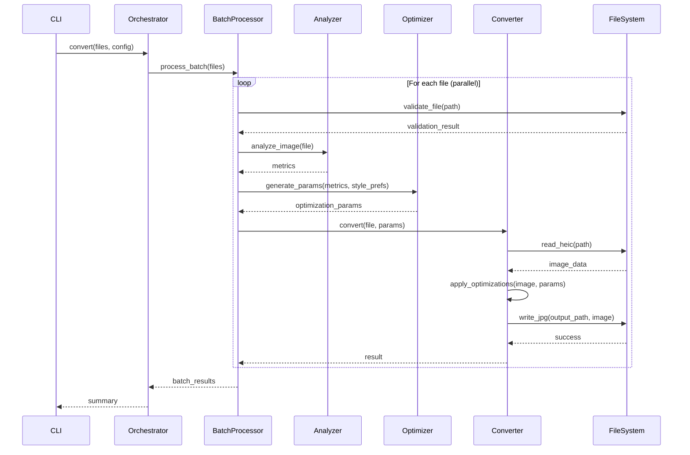

# Design Document: HEIC to JPG Converter

## Overview

The HEIC to JPG Converter is a Python 3.14 application that converts iPhone HEIC photos to high-quality JPG format optimized for silver halide (analog) printing. The system features per-image analysis and optimization, parallel batch processing, cross-platform compatibility, and comprehensive CI/CD automation.

### Key Design Principles

1. **Quality First**: Default to uncompressed JPG (quality 100) with per-image optimization
2. **Performance**: Leverage parallel processing for batch operations
3. **Cross-Platform**: Support macOS, Windows, and Linux with platform-independent code
4. **Security**: Follow security best practices for file handling and validation
5. **Maintainability**: Clear architecture, comprehensive testing, and bilingual documentation
6. **Modern Python**: Utilize Python 3.14 features for improved performance and type safety

## Architecture

### High-Level Architecture

```
┌─────────────────────────────────────────────────────────────┐
│                     CLI Interface Layer                      │
│  (argparse, rich for progress display)                      │
└────────────────────┬────────────────────────────────────────┘
                     │
┌────────────────────▼────────────────────────────────────────┐
│                  Conversion Orchestrator                     │
│  (Single/Batch mode routing, configuration management)      │
└────────┬───────────────────────────────┬────────────────────┘
         │                               │
┌────────▼──────────┐         ┌─────────▼──────────────────┐
│  Single Converter │         │   Batch Processor          │
│                   │         │  (Parallel execution)      │
└────────┬──────────┘         └─────────┬──────────────────┘
         │                               │
         └───────────────┬───────────────┘
                         │
         ┌───────────────▼────────────────────┐
         │      Image Analysis Engine         │
         │  (Per-image metrics calculation)   │
         └───────────────┬────────────────────┘
                         │
         ┌───────────────▼────────────────────┐
         │    Optimization Parameter          │
         │         Generator                  │
         │  (Natural style, preserve          │
         │   highlights, stable skin tones)   │
         └───────────────┬────────────────────┘
                         │
         ┌───────────────▼────────────────────┐
         │      Image Converter Core          │
         │  (HEIC decode, adjust, JPG encode) │
         └───────────────┬────────────────────┘
                         │
         ┌───────────────▼────────────────────┐
         │      File System Handler           │
         │  (Platform-independent I/O,        │
         │   validation, security checks)     │
         └────────────────────────────────────┘
```

### Component Interaction Flow



## Components and Interfaces

### 1. CLI Interface Layer

**Responsibility**: Parse command-line arguments, display progress, and format output.

**Interface**:
```python
class CLIInterface:
    def parse_arguments(self) -> Config:
        """Parse command-line arguments and return configuration."""
        
    def display_progress(self, current: int, total: int, filename: str) -> None:
        """Display conversion progress using rich progress bars."""
        
    def display_summary(self, results: BatchResults) -> None:
        """Display conversion summary with success/failure counts."""
        
    def handle_error(self, error: ConversionError) -> None:
        """Display formatted error message."""
```

**Key Features**:
- Uses `argparse` for argument parsing
- Uses `rich` library for beautiful progress bars and formatted output
- Supports `--quality`, `--output-dir`, `--no-overwrite`, `--verbose` flags
- Provides `--help` and `--version` information

### 2. Conversion Orchestrator

**Responsibility**: Route requests to single or batch processing, manage configuration.

**Interface**:
```python
@dataclass
class Config:
    quality: int = 100
    output_dir: Path | None = None
    no_overwrite: bool = False
    verbose: bool = False
    parallel_workers: int | None = None
    style_preferences: StylePreferences = field(default_factory=StylePreferences)

@dataclass
class StylePreferences:
    natural_appearance: bool = True
    preserve_highlights: bool = True
    stable_skin_tones: bool = True
    avoid_filter_look: bool = True

class ConversionOrchestrator:
    def __init__(self, config: Config):
        """Initialize with configuration."""
        
    def convert_single(self, input_path: Path) -> ConversionResult:
        """Convert a single HEIC file."""
        
    def convert_batch(self, input_paths: list[Path]) -> BatchResults:
        """Convert multiple HEIC files in parallel."""
```

### 3. Batch Processor

**Responsibility**: Manage parallel execution of conversions using multiprocessing.

**Interface**:
```python
class BatchProcessor:
    def __init__(self, config: Config):
        """Initialize with configuration and determine worker count."""
        
    def process_batch(self, files: list[Path]) -> BatchResults:
        """Process multiple files in parallel using ProcessPoolExecutor."""
        
    def _process_single_file(self, file_path: Path) -> ConversionResult:
        """Process a single file (called by worker processes)."""
```

**Implementation Notes**:
- Uses `concurrent.futures.ProcessPoolExecutor` for true parallelism
- Worker count defaults to `os.cpu_count()` or can be configured
- Implements proper error isolation (one file failure doesn't stop batch)
- Uses `multiprocessing.Manager` for shared progress tracking

### 4. Image Analysis Engine

**Responsibility**: Analyze individual images for exposure, contrast, clipping, saturation, sharpness, and noise.

**Interface**:
```python
@dataclass
class ImageMetrics:
    exposure_level: float  # -2.0 to +2.0 EV
    contrast_level: float  # 0.0 to 1.0
    shadow_clipping_percent: float  # 0.0 to 100.0
    highlight_clipping_percent: float  # 0.0 to 100.0
    saturation_level: float  # 0.0 to 2.0
    sharpness_score: float  # 0.0 to 1.0
    noise_level: float  # 0.0 to 1.0
    skin_tone_detected: bool
    skin_tone_hue_range: tuple[float, float] | None
    is_backlit: bool  # Detected backlit subject
    is_low_light: bool  # Detected low-light conditions
    exif_data: EXIFMetadata | None

@dataclass
class EXIFMetadata:
    iso: int | None  # ISO sensitivity
    exposure_time: float | None  # Shutter speed in seconds
    f_number: float | None  # Aperture f-number
    exposure_compensation: float | None  # EV compensation
    flash_fired: bool | None  # Whether flash was used
    scene_type: str | None  # Scene type (portrait, landscape, night, etc.)
    brightness_value: float | None  # EXIF brightness value
    metering_mode: str | None  # Metering mode used

class ImageAnalyzer:
    def analyze(self, image: np.ndarray, exif: EXIFMetadata | None = None) -> ImageMetrics:
        """Analyze image and return comprehensive metrics, using EXIF data when available."""
        
    def _calculate_exposure(self, image: np.ndarray, exif: EXIFMetadata | None) -> float:
        """Calculate exposure level using histogram analysis and EXIF data."""
        
    def _calculate_contrast(self, image: np.ndarray) -> float:
        """Calculate contrast using standard deviation of luminance."""
        
    def _detect_clipping(self, image: np.ndarray) -> tuple[float, float]:
        """Detect shadow and highlight clipping percentages."""
        
    def _calculate_saturation(self, image: np.ndarray) -> float:
        """Calculate average saturation in HSV color space."""
        
    def _calculate_sharpness(self, image: np.ndarray) -> float:
        """Calculate sharpness using Laplacian variance."""
        
    def _estimate_noise(self, image: np.ndarray, exif: EXIFMetadata | None) -> float:
        """
        Estimate noise level using high-frequency analysis and ISO information.
        Higher ISO typically means more noise.
        """
        
    def _detect_skin_tones(self, image: np.ndarray) -> tuple[bool, tuple[float, float] | None]:
        """Detect presence and hue range of skin tones."""
    
    def _detect_backlit_subject(self, image: np.ndarray) -> bool:
        """
        Detect backlit subjects by analyzing luminance distribution.
        Backlit images typically have bright backgrounds and dark foregrounds.
        """
    
    def _detect_low_light(self, image: np.ndarray, exif: EXIFMetadata | None) -> bool:
        """
        Detect low-light conditions using histogram analysis and EXIF data.
        Consider ISO > 800, slow shutter speed, and overall darkness.
        """
```

**Implementation Notes**:
- Uses NumPy for efficient array operations
- Uses OpenCV (cv2) for image processing operations
- Exposure calculated from luminance histogram (middle 50% mean), adjusted by EXIF exposure compensation
- Contrast calculated from luminance standard deviation
- Clipping detected by counting pixels at extremes (0-5, 250-255)
- Saturation calculated in HSV color space
- Sharpness measured using Laplacian variance method
- Noise estimated from high-frequency components, informed by ISO value (ISO > 800 indicates likely noise)
- Skin tone detection uses HSV hue range (0-50 degrees)
- Backlit detection: checks if center region is significantly darker than edges
- Low-light detection: combines histogram analysis (mean luminance < 0.3) with EXIF data (ISO > 800 or exposure time > 1/30s)

### 5. Optimization Parameter Generator

**Responsibility**: Generate per-image optimization parameters based on analysis and style preferences.

**Interface**:
```python
@dataclass
class OptimizationParams:
    exposure_adjustment: float  # -2.0 to +2.0 EV
    contrast_adjustment: float  # 0.5 to 1.5 multiplier
    shadow_lift: float  # 0.0 to 1.0
    highlight_recovery: float  # 0.0 to 1.0
    saturation_adjustment: float  # 0.5 to 1.5 multiplier
    sharpness_amount: float  # 0.0 to 2.0
    noise_reduction: float  # 0.0 to 1.0
    skin_tone_protection: bool

class OptimizationParamGenerator:
    def __init__(self, style_prefs: StylePreferences):
        """Initialize with style preferences."""
        
    def generate(self, metrics: ImageMetrics) -> OptimizationParams:
        """Generate optimization parameters from metrics and style preferences."""
        
    def _calculate_exposure_adjustment(self, metrics: ImageMetrics) -> float:
        """Calculate exposure adjustment to target middle gray."""
        
    def _calculate_contrast_adjustment(self, metrics: ImageMetrics) -> float:
        """Calculate contrast adjustment for natural appearance."""
        
    def _calculate_highlight_recovery(self, metrics: ImageMetrics) -> float:
        """Calculate highlight recovery to preserve detail."""
        
    def _calculate_shadow_lift(self, metrics: ImageMetrics) -> float:
        """Calculate shadow lift to prevent crushing."""
        
    def _calculate_saturation_adjustment(self, metrics: ImageMetrics) -> float:
        """Calculate saturation adjustment for natural colors."""
        
    def _calculate_sharpness(self, metrics: ImageMetrics) -> float:
        """Calculate sharpening amount based on current sharpness."""
        
    def _calculate_noise_reduction(self, metrics: ImageMetrics) -> float:
        """Calculate noise reduction amount."""
```

**Optimization Strategy**:
- **Natural Appearance**: Subtle adjustments, avoid over-processing
- **Preserve Highlights**: Aggressive highlight recovery when clipping > 5%
- **Stable Skin Tones**: Protect skin tone hue ranges from saturation changes
- **Avoid Filter Look**: Limit adjustment ranges, prefer gentle curves
- **Challenging Lighting Handling**:
  - **Overexposure**: Apply strong highlight recovery (0.8-1.0) when highlight clipping > 10%
  - **Backlit Subjects**: Lift shadows (0.5-0.8) while preserving highlights, use local contrast enhancement
  - **Low-Light/Night**: Apply adaptive noise reduction based on ISO and measured noise level
    - ISO < 400: Minimal noise reduction (0.0-0.2)
    - ISO 400-800: Moderate noise reduction (0.2-0.5)
    - ISO 800-1600: Strong noise reduction (0.5-0.7)
    - ISO > 1600: Very strong noise reduction (0.7-0.9)
  - Balance noise reduction with detail preservation using bilateral filtering
  - Use EXIF flash information: if flash fired, reduce shadow lift to avoid unnatural look

### 6. Image Converter Core

**Responsibility**: Decode HEIC, apply optimizations, encode to JPG.

**Interface**:
```python
class ImageConverter:
    def __init__(self, config: Config):
        """Initialize with configuration."""
        
    def convert(
        self, 
        input_path: Path, 
        output_path: Path,
        optimization_params: OptimizationParams
    ) -> ConversionResult:
        """Convert HEIC to JPG with optimizations."""
        
    def _decode_heic(self, path: Path) -> tuple[np.ndarray, dict]:
        """Decode HEIC file and extract EXIF metadata."""
        
    def _apply_optimizations(
        self, 
        image: np.ndarray, 
        params: OptimizationParams
    ) -> np.ndarray:
        """Apply optimization parameters to image."""
        
    def _encode_jpg(
        self, 
        image: np.ndarray, 
        path: Path, 
        quality: int,
        exif: dict
    ) -> None:
        """Encode image as JPG with EXIF metadata."""
```

**Implementation Notes**:
- Uses `pillow-heif` library for HEIC decoding
- Uses `Pillow` (PIL) for JPG encoding
- Uses `piexif` for EXIF metadata preservation and extraction
- Applies optimizations in specific order:
  1. Exposure adjustment (multiply luminance)
  2. Contrast adjustment (apply curve)
  3. Shadow lift (lift dark values, stronger for backlit images)
  4. Highlight recovery (compress bright values, stronger for overexposed images)
  5. Saturation adjustment (modify in HSV space)
  6. Noise reduction (adaptive bilateral filter based on ISO and measured noise)
     - Bilateral filter preserves edges while smoothing noise
     - Filter strength adapts to ISO: sigma_color = 25 + (ISO/100) * 25
     - Filter size adapts to noise level: diameter = 5 + int(noise_level * 10)
  7. Sharpening (unsharp mask, reduced if heavy noise reduction was applied)
- For low-light images: apply noise reduction before sharpening to avoid amplifying noise
- For backlit images: use local adaptive histogram equalization (CLAHE) on shadow regions only

### 7. File System Handler

**Responsibility**: Platform-independent file I/O with security validation.

**Interface**:
```python
class FileSystemHandler:
    def validate_input_file(self, path: Path) -> ValidationResult:
        """Validate input file exists, is readable, and is HEIC format."""
        
    def validate_output_path(self, path: Path, no_overwrite: bool) -> ValidationResult:
        """Validate output path is writable and handle overwrite logic."""
        
    def read_file(self, path: Path) -> bytes:
        """Read file with security checks."""
        
    def write_file(self, path: Path, data: bytes) -> None:
        """Write file with security checks."""
        
    def get_output_path(
        self, 
        input_path: Path, 
        output_dir: Path | None
    ) -> Path:
        """Generate output path from input path."""
        
    def ensure_directory(self, path: Path) -> None:
        """Create directory if it doesn't exist."""
```

**Security Features**:
- Path traversal prevention using `Path.resolve()`
- File size validation (reject files > 500MB)
- Extension validation (only .heic, .heif accepted)
- Permission checks before read/write operations
- Atomic writes using temporary files

## Data Models

### Core Data Structures

```python
from dataclasses import dataclass
from pathlib import Path
from enum import Enum

class ConversionStatus(Enum):
    SUCCESS = "success"
    FAILED = "failed"
    SKIPPED = "skipped"

@dataclass
class ConversionResult:
    input_path: Path
    output_path: Path | None
    status: ConversionStatus
    error_message: str | None = None
    metrics: ImageMetrics | None = None
    optimization_params: OptimizationParams | None = None
    processing_time: float = 0.0

@dataclass
class BatchResults:
    results: list[ConversionResult]
    total_files: int
    successful: int
    failed: int
    skipped: int
    total_time: float
    
    def success_rate(self) -> float:
        """Calculate success rate as percentage."""
        return (self.successful / self.total_files * 100) if self.total_files > 0 else 0.0

@dataclass
class ValidationResult:
    valid: bool
    error_message: str | None = None

class ConversionError(Exception):
    """Base exception for conversion errors."""
    pass

class InvalidFileError(ConversionError):
    """Raised when input file is invalid."""
    pass

class SecurityError(ConversionError):
    """Raised when security validation fails."""
    pass

class ProcessingError(ConversionError):
    """Raised when image processing fails."""
    pass
```

## Correctness Properties

*A property is a characteristic or behavior that should hold true across all valid executions of a system—essentially, a formal statement about what the system should do. Properties serve as the bridge between human-readable specifications and machine-verifiable correctness guarantees.*

Before defining the correctness properties, let me analyze each acceptance criterion for testability:


### Property 1: HEIC to JPG Conversion Success
*For any* valid HEIC file, converting it should produce a valid JPG file with the same dimensions.
**Validates: Requirements 1.1, 1.2**

### Property 2: EXIF Metadata Preservation
*For any* HEIC file with EXIF metadata, the converted JPG file should contain the same EXIF metadata.
**Validates: Requirements 1.3**

### Property 3: Invalid Input Error Handling
*For any* file that is not a valid HEIC file (wrong format or corrupted), the converter should return a descriptive error message without crashing.
**Validates: Requirements 1.4, 1.5**

### Property 4: Quality Configuration Acceptance
*For any* valid quality value (0-100) provided via configuration or environment variable, the converter should use that quality level for JPG encoding.
**Validates: Requirements 2.2, 2.3**

### Property 5: Quality Validation
*For any* quality value outside the range 0-100, the converter should reject it with an error and fall back to the default quality of 100.
**Validates: Requirements 2.4, 2.5**

### Property 6: Parallel Processing Performance
*For any* batch of N files where N > 1, the total processing time should be less than N times the average single-file processing time (demonstrating parallelism).
**Validates: Requirements 3.1**

### Property 7: Batch Result Reporting Accuracy
*For any* batch conversion, the reported counts of successful, failed, and skipped conversions should exactly match the actual results.
**Validates: Requirements 3.3, 3.4**

### Property 8: Batch Error Isolation
*For any* batch containing at least one invalid file, the failure of that file should not prevent the processing of other valid files in the batch.
**Validates: Requirements 3.5**

### Property 9: English-Only Output
*For any* conversion operation, all log messages, error messages, and user-facing output should contain only English text (ASCII or common English Unicode characters).
**Validates: Requirements 13.3, 13.4, 13.5**

### Property 10: Path Traversal Prevention
*For any* file path containing directory traversal patterns (e.g., "../", "..\\"), the converter should reject it with a security error.
**Validates: Requirements 14.1**

### Property 11: File Size Validation
*For any* file larger than the maximum allowed size (500MB), the converter should reject it with an error before attempting to load it into memory.
**Validates: Requirements 14.2**

### Property 12: Progress Feedback
*For any* conversion operation, progress callbacks or updates should be provided at regular intervals during processing.
**Validates: Requirements 15.5**

### Property 13: Descriptive Error Messages
*For any* error condition, the error message should be non-empty, contain relevant context (e.g., filename), and describe the problem clearly.
**Validates: Requirements 16.1**

### Property 14: Operation Logging
*For any* conversion operation (successful or failed), the operation should be logged with relevant context including filename, status, and timestamp.
**Validates: Requirements 16.2, 16.4**

### Property 15: Configurable Logging Levels
*For any* logging level configuration (DEBUG, INFO, WARNING, ERROR), the log output should respect that level and only show messages at or above the configured level.
**Validates: Requirements 16.3**

### Property 16: Verbose Logging Detail
*For any* conversion operation with verbose logging enabled, the logs should contain more detailed information than with verbose logging disabled.
**Validates: Requirements 16.5**

### Property 17: CLI Quality Argument Parsing
*For any* valid quality value passed via command-line argument, the converter should parse and use that value correctly.
**Validates: Requirements 17.3**

### Property 18: Output Filename Transformation
*For any* input HEIC file with name "X.heic", the default output filename should be "X.jpg" (preserving the base name, changing extension).
**Validates: Requirements 18.1**

### Property 19: Output Directory Specification
*For any* specified output directory, all converted files should be saved to that directory regardless of the input file locations.
**Validates: Requirements 18.2**

### Property 20: Output Filename Pattern Application
*For any* specified filename pattern (e.g., "{name}_converted.jpg"), the output filenames should follow that pattern.
**Validates: Requirements 18.3**

### Property 21: No-Overwrite Flag Behavior
*For any* existing output file, when the no-overwrite flag is set, the converter should skip that file without prompting and without overwriting.
**Validates: Requirements 18.5**

### Property 22: Per-Image Analysis Independence
*For any* batch of images with different visual characteristics, each image should receive different analysis metrics (exposure, contrast, clipping, saturation, sharpness, noise).
**Validates: Requirements 19.1, 19.2, 19.3, 19.4, 19.5, 19.6**

### Property 23: Per-Image Optimization Parameters
*For any* batch of images with different analysis metrics, each image should receive different optimization parameters rather than shared batch-wide parameters.
**Validates: Requirements 19.7**

### Property 24: Highlight Preservation
*For any* image conversion, the highlight clipping percentage in the output should not exceed the highlight clipping percentage in the input (highlights should be preserved or improved, not degraded).
**Validates: Requirements 19.9**

### Property 25: Skin Tone Stability
*For any* image containing detected skin tones, the hue range of skin tones in the output should remain within acceptable bounds of the input skin tone hue range.
**Validates: Requirements 19.10**

### Property 26: Analysis Metrics Persistence
*For any* converted image, the analysis metrics should be saved (returned in result object or written to file) for review and tuning purposes.
**Validates: Requirements 19.12**

### Property 27: Platform-Independent Path Handling
*For any* file path, the converter should handle it correctly using platform-independent path operations (pathlib.Path) that work on Windows, macOS, and Linux.
**Validates: Requirements 20.4**

### Property 28: Platform-Independent Line Endings
*For any* text output (logs, reports), the converter should handle line endings correctly on all platforms without corruption.
**Validates: Requirements 20.6**

### Property 29: EXIF-Informed Noise Reduction
*For any* image with EXIF ISO information, the noise reduction strength should be proportional to the ISO value (higher ISO = stronger noise reduction).
**Validates: Requirements 21.6**

### Property 30: Backlit Subject Shadow Recovery
*For any* image detected as backlit, shadow areas should be lifted while highlight areas remain preserved or improved.
**Validates: Requirements 21.2**

### Property 31: Low-Light Noise Reduction Quality
*For any* image detected as low-light, the output should have reduced visible noise compared to the input while preserving detail.
**Validates: Requirements 21.3, 21.4**

### Property 32: EXIF Data Fallback
*For any* image without EXIF data or with incomplete EXIF data, the converter should successfully analyze and optimize the image using image analysis alone.
**Validates: Requirements 21.10**

## Error Handling

### Error Categories

1. **Input Validation Errors**
   - Invalid file format (not HEIC)
   - Corrupted HEIC file
   - File not found
   - File not readable (permissions)
   - File too large (> 500MB)

2. **Security Errors**
   - Path traversal attempt
   - Invalid output path
   - Permission denied

3. **Processing Errors**
   - HEIC decode failure
   - Image processing failure
   - JPG encode failure
   - EXIF metadata extraction failure

4. **Configuration Errors**
   - Invalid quality value
   - Invalid output directory
   - Invalid filename pattern

### Error Handling Strategy

```python
class ErrorHandler:
    def handle_error(
        self, 
        error: Exception, 
        context: dict[str, Any]
    ) -> ConversionResult:
        """
        Handle errors with appropriate logging and user feedback.
        
        Strategy:
        1. Log error with full context and stack trace
        2. Classify error type
        3. Generate user-friendly error message
        4. Return ConversionResult with FAILED status
        5. Never crash - always return a result
        """
        
    def _classify_error(self, error: Exception) -> ErrorCategory:
        """Classify error into category for appropriate handling."""
        
    def _generate_user_message(
        self, 
        error: Exception, 
        category: ErrorCategory
    ) -> str:
        """Generate clear, actionable error message for user."""
```

### Error Recovery

- **Single file conversion**: Return error result, log details
- **Batch conversion**: Log error, continue with remaining files
- **Critical errors**: Stop processing, report to user
- **Transient errors**: Optionally retry with exponential backoff

### Logging Strategy

```python
# Logging levels and their usage:
# DEBUG: Detailed diagnostic information (metrics, parameters, timing)
# INFO: General operational information (file started, completed)
# WARNING: Unexpected but handled situations (skipped files, fallback to defaults)
# ERROR: Error conditions (failed conversions, invalid inputs)
# CRITICAL: System-level failures (out of memory, disk full)

# Example log messages:
# INFO: Converting image.heic (1/10)
# DEBUG: Analysis metrics: exposure=0.5, contrast=0.7, clipping=(2.1%, 0.3%)
# DEBUG: Optimization params: exposure_adj=-0.2, highlight_recovery=0.8
# INFO: Converted image.heic -> image.jpg (2.3s)
# WARNING: Output file exists, skipping: image.jpg
# ERROR: Failed to convert corrupt.heic: Invalid HEIC file format
```

## Testing Strategy

### Dual Testing Approach

The testing strategy employs both **unit tests** and **property-based tests** as complementary approaches:

- **Unit tests**: Verify specific examples, edge cases, and error conditions
- **Property tests**: Verify universal properties across all inputs using randomized testing

Both are necessary for comprehensive coverage. Unit tests catch concrete bugs in specific scenarios, while property tests verify general correctness across a wide input space.

### Property-Based Testing Configuration

**Library**: Use `hypothesis` for Python property-based testing

**Configuration**:
- Minimum 100 iterations per property test (due to randomization)
- Each property test must reference its design document property
- Tag format: `# Feature: heic2jpg, Property {number}: {property_text}`

**Example Property Test Structure**:
```python
from hypothesis import given, strategies as st
import pytest

# Feature: heic2jpg, Property 1: HEIC to JPG Conversion Success
@given(heic_file=st.heic_files())  # Custom strategy
@pytest.mark.property_test
def test_heic_to_jpg_conversion_preserves_dimensions(heic_file):
    """For any valid HEIC file, conversion should preserve dimensions."""
    result = converter.convert(heic_file)
    
    assert result.status == ConversionStatus.SUCCESS
    assert result.output_path.exists()
    
    input_dims = get_image_dimensions(heic_file)
    output_dims = get_image_dimensions(result.output_path)
    
    assert input_dims == output_dims
```

### Unit Testing Focus Areas

Unit tests should focus on:

1. **Specific Examples**
   - Default quality is 100 (Requirement 2.1)
   - CLI provides help with --help flag (Requirement 17.4)
   - CLI provides version with --version flag (Requirement 17.5)
   - Overwrite prompt shown when file exists (Requirement 18.4)

2. **Edge Cases**
   - Empty batch (0 files)
   - Single file batch
   - Very small images (1x1 pixel)
   - Images with no EXIF data
   - Images with extreme exposure (very dark/bright)

3. **Integration Points**
   - CLI argument parsing
   - Configuration loading from environment
   - File system operations
   - Logging output format

4. **Error Conditions**
   - Specific error message formats
   - Error recovery behavior
   - Logging of errors

### Test Data Strategy

**Synthetic Test Images**:
- Generate test HEIC files programmatically using Pillow
- Create images with known characteristics:
  - Specific dimensions
  - Known EXIF data
  - Controlled exposure/contrast/saturation
  - Presence/absence of skin tones
  - Various noise levels

**Test Fixtures**:
- Small set of real HEIC files from iPhone (with permission)
- Corrupted HEIC files for error testing
- Non-HEIC files (JPG, PNG) for format validation

### Custom Hypothesis Strategies

```python
from hypothesis import strategies as st
from PIL import Image
import pillow_heif

@st.composite
def heic_files(draw, 
               min_width=100, max_width=4000,
               min_height=100, max_height=4000):
    """Generate random valid HEIC files for testing."""
    width = draw(st.integers(min_value=min_width, max_value=max_width))
    height = draw(st.integers(min_value=min_height, max_value=max_height))
    
    # Generate random RGB image
    image = Image.new('RGB', (width, height))
    pixels = draw(st.lists(
        st.tuples(
            st.integers(0, 255),
            st.integers(0, 255),
            st.integers(0, 255)
        ),
        min_size=width*height,
        max_size=width*height
    ))
    image.putdata(pixels)
    
    # Convert to HEIC
    heif_file = pillow_heif.from_pillow(image)
    return heif_file

@st.composite
def quality_values(draw):
    """Generate valid quality values (0-100)."""
    return draw(st.integers(min_value=0, max_value=100))

@st.composite
def invalid_quality_values(draw):
    """Generate invalid quality values (outside 0-100)."""
    return draw(st.one_of(
        st.integers(max_value=-1),
        st.integers(min_value=101)
    ))

@st.composite
def malicious_paths(draw):
    """Generate paths with directory traversal attempts."""
    return draw(st.one_of(
        st.just("../etc/passwd"),
        st.just("..\\windows\\system32"),
        st.just("../../sensitive/data"),
        st.just("./../../etc/shadow")
    ))
```

### Test Coverage Goals

- **Line coverage**: > 90%
- **Branch coverage**: > 85%
- **Property test iterations**: 100 per property
- **Unit test count**: ~50-100 tests
- **Property test count**: 28 tests (one per property)

### CI/CD Testing Pipeline

**GitHub Actions Workflow**:

```yaml
name: Test Suite

on: [push, pull_request]

jobs:
  test:
    runs-on: ${{ matrix.os }}
    strategy:
      matrix:
        os: [ubuntu-latest, macos-latest, windows-latest]
        python-version: ['3.14']
    
    steps:
      - uses: actions/checkout@v4
      
      - name: Set up Python
        uses: actions/setup-python@v5
        with:
          python-version: ${{ matrix.python-version }}
      
      - name: Install uv
        run: pip install uv
      
      - name: Install dependencies
        run: uv sync
      
      - name: Run unit tests
        run: uv run pytest tests/unit -v --cov
      
      - name: Run property tests
        run: uv run pytest tests/property -v --hypothesis-show-statistics
      
      - name: Run integration tests
        run: uv run pytest tests/integration -v
      
      - name: Upload coverage
        uses: codecov/codecov-action@v4
```

### Performance Testing

While not part of functional correctness, performance should be validated:

- **Benchmark tests**: Measure conversion time for standard images
- **Scalability tests**: Verify parallel processing scales with CPU cores
- **Memory tests**: Ensure memory usage stays within bounds
- **Regression tests**: Detect performance regressions between versions

## Implementation Notes

### Python 3.14 Features to Leverage

1. **Type Parameter Syntax (PEP 695)**:
   ```python
   def process_batch[T](items: list[T]) -> list[Result[T]]:
       ...
   ```

2. **Improved Error Messages**: Better debugging with enhanced tracebacks

3. **Performance Improvements**: Faster startup time and reduced memory usage

4. **Pattern Matching Enhancements**: Use for error handling and result processing

### Key Dependencies

```toml
[project]
dependencies = [
    "pillow>=10.0.0",           # JPG encoding/decoding
    "pillow-heif>=0.13.0",      # HEIC decoding
    "piexif>=1.1.3",            # EXIF metadata handling
    "numpy>=1.26.0",            # Image array operations
    "opencv-python>=4.8.0",     # Image analysis
    "rich>=13.0.0",             # CLI progress and formatting
    "click>=8.1.0",             # CLI framework
]

[project.optional-dependencies]
dev = [
    "pytest>=7.4.0",
    "pytest-cov>=4.1.0",
    "hypothesis>=6.90.0",       # Property-based testing
    "ruff>=0.1.0",              # Linting and formatting
    "mypy>=1.7.0",              # Type checking
    "bandit>=1.7.5",            # Security scanning
]
```

### Security Considerations

1. **Input Validation**:
   - Validate all file paths using `Path.resolve()` to prevent traversal
   - Check file extensions against whitelist
   - Validate file sizes before loading
   - Use safe file operations (no shell commands)

2. **Resource Limits**:
   - Maximum file size: 500MB
   - Maximum batch size: 1000 files
   - Timeout for single conversion: 60 seconds
   - Memory limit per worker process

3. **Dependency Security**:
   - Pin dependency versions in lock file
   - Regular security audits using `pip-audit`
   - Automated dependency updates via Dependabot
   - Verify package signatures where available

### Cross-Platform Considerations

1. **Path Handling**:
   - Always use `pathlib.Path` for path operations
   - Use `Path.resolve()` for absolute paths
   - Use `Path.as_posix()` for display only
   - Never use string concatenation for paths

2. **Multiprocessing**:
   - Use `spawn` method on all platforms for consistency
   - Properly handle process pool cleanup
   - Use `if __name__ == "__main__":` guard

3. **File Operations**:
   - Use binary mode for image files
   - Handle platform-specific line endings in text files
   - Use `os.replace()` for atomic file operations

4. **Testing**:
   - Run CI tests on Windows, macOS, and Linux
   - Test path handling on all platforms
   - Verify multiprocessing works on all platforms

## Project Structure

```
heic2jpg/
├── .github/
│   └── workflows/
│       ├── test.yml              # Test automation
│       ├── lint.yml              # Code quality checks
│       ├── security.yml          # Security scanning
│       └── dependabot.yml        # Dependency updates
├── src/
│   └── heic2jpg/
│       ├── __init__.py
│       ├── __main__.py           # CLI entry point
│       ├── cli.py                # CLI interface
│       ├── orchestrator.py       # Conversion orchestrator
│       ├── batch_processor.py    # Batch processing
│       ├── analyzer.py           # Image analysis
│       ├── optimizer.py          # Parameter generation
│       ├── converter.py          # Core conversion
│       ├── filesystem.py         # File system operations
│       ├── models.py             # Data models
│       └── errors.py             # Error definitions
├── tests/
│   ├── unit/                     # Unit tests
│   ├── property/                 # Property-based tests
│   ├── integration/              # Integration tests
│   ├── conftest.py               # Pytest configuration
│   └── strategies.py             # Hypothesis strategies
├── docs/
│   ├── README.md                 # English documentation
│   ├── README.zh-CN.md           # Chinese documentation
│   ├── AGENTS.md                 # AI agent guidance
│   ├── CONTRIBUTING.md           # Contribution guidelines
│   └── api/                      # API documentation
├── pyproject.toml                # Project configuration
├── uv.lock                       # Dependency lock file
├── .python-version               # Python version specification
├── .gitignore
├── LICENSE
└── CHANGELOG.md
```

## Documentation Requirements

### README.md (English)

- Project overview and purpose
- Installation instructions (uv-based)
- Quick start guide
- Usage examples (single file, batch)
- Configuration options
- Troubleshooting
- Contributing guidelines
- License information

### README.zh-CN.md (Chinese)

- Same content as English README
- Translated to Chinese
- Maintained in parallel with English version

### AGENTS.md

- Project architecture overview
- Key design decisions and rationale
- Development workflow
- Testing strategy and how to run tests
- Code style guidelines
- Common tasks and how to accomplish them
- Debugging tips
- Performance optimization notes

### API Documentation

- Generated from docstrings using Sphinx
- Available in both English and Chinese
- Includes:
  - Module documentation
  - Class and function references
  - Usage examples
  - Type signatures

## Deployment and Distribution

### Package Distribution

- Publish to PyPI as `heic2jpg`
- Semantic versioning (MAJOR.MINOR.PATCH)
- Automated releases via GitHub Actions
- Include pre-built wheels for major platforms

### Installation Methods

```bash
# Via uv (recommended)
uv pip install heic2jpg

# Via pip
pip install heic2jpg

# From source
git clone https://github.com/user/heic2jpg
cd heic2jpg
uv sync
uv run heic2jpg --help
```

### CLI Usage Examples

```bash
# Convert single file
heic2jpg input.heic

# Convert with custom quality
heic2jpg input.heic --quality 95

# Batch convert directory
heic2jpg *.heic --output-dir ./converted

# Batch convert with no overwrite
heic2jpg *.heic --no-overwrite

# Verbose logging
heic2jpg input.heic --verbose

# Show help
heic2jpg --help

# Show version
heic2jpg --version
```

## Future Enhancements

Potential future improvements (not in current scope):

1. **GUI Interface**: Desktop application using PyQt or Tkinter
2. **Web Interface**: Web-based converter using FastAPI
3. **Batch Presets**: Save and load optimization presets
4. **Custom Style Profiles**: User-defined style preferences
5. **RAW Format Support**: Support for camera RAW formats
6. **Video Conversion**: Support for HEIC video sequences
7. **Cloud Integration**: Direct upload to cloud storage
8. **Metadata Editing**: Edit EXIF data during conversion
9. **Watermarking**: Add watermarks to converted images
10. **Format Conversion**: Support other output formats (PNG, TIFF)
